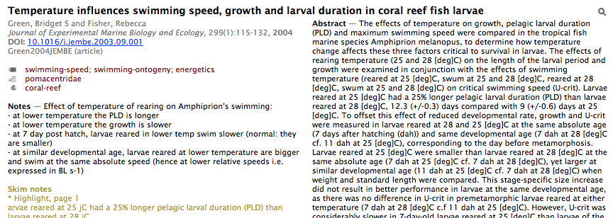

## Description

This is a template to be used in the lower pane of [BibDesk](http://bibdesk.sourceforge.net "BibDesk") to display information about the selected paper. It uses two columns to be more readable and space efficient, shows the Annote field and the highlights made in [Skim](http://skim-app.sourceforge.net "Skim | Home"), displays dynamic links for DOI and PubMed IDs, and allows to search for the publication on Google Scholar (to find PDFs, check out citations, etc.).

Here is how it looks:

## Installation

Download a ZIP archive of this project from Github.

Copy the two HTML files and the CSS file to `~/Library/Application Support/BibDesk/Templates/`. The `Library` folder is hidden by default. To reach this destination, select `Go > Go To Folder` in the Finder's menu and copy-paste the path above.

In Bibdesk preferences, go to Templates. With the `+` button add a new template. As instructed, double click the red text to browse for the files you just copied. By default you should be in the right folder. Select `twoColumns-htmlTemplate.html` first. Then, inside that template, add a new file with the same `+` button. Select `twoColumns-htmlItemTemplate.html` and give it the `Default Item` role. Finally, add another file, select the `twoColumns-cssStyle.css` file and give it the `Accessory File` role.

Finally, under the preview pane, at the bottom, select the new template.
